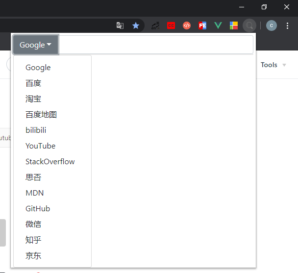
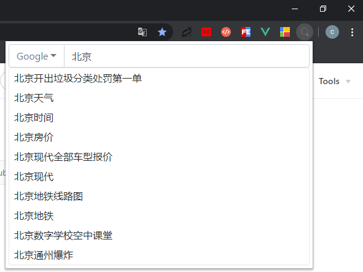
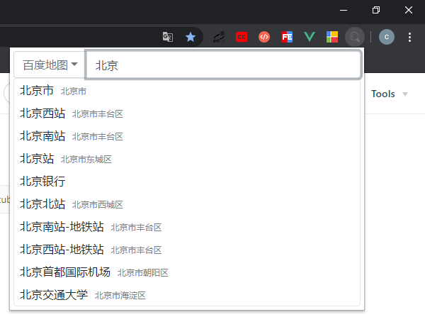
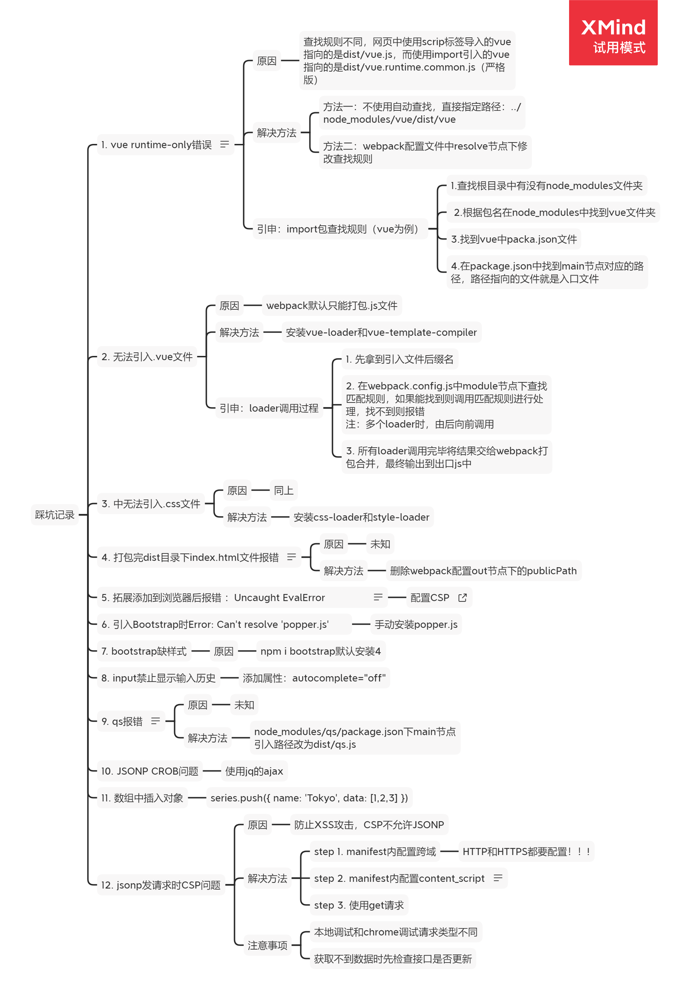

# QuickSearch v2.0
### 简介
基于Vanilla.JS开发的chrome快速搜索功能扩展，内置Google、百度、地图、淘宝、B站、知乎、微信等多个搜索引擎。多种操作方式，自动控制焦点，全程无需鼠标，纯键盘控制切换引擎、搜索、选择联想内容并根据搜索引擎不同给出不同联想内容。
### 更新日志
+ 版本：v2.0
    + 使用纯JavaScript重构了项目
    + 增加自定义搜索引擎功能
    + 增加深色模式
    + 增加引擎拖拽排序功能
+ 版本：v1.01
    + fix：vue实例中el绑定的元素id="app"情况下访问页面内有id="app"的元素的网站时内容被扩展替换的bug
### 技术栈
+ JavaScript
### 使用
+ 唤醒扩展
    + 浏览器右上角-设置-扩展程序-键盘快捷键-找到QuickSearch-设置自定义快捷键
+ 切换搜索引擎
    + 按Tab键打开下拉列表，然后按数字键选择需要的引擎，或者使用 ↑  ↓ 键选中按回车选择 
    + 鼠标点击左侧按钮
+ 调整搜索引擎顺序
    + 打开下拉列表，然后按住鼠标左键拖动
+ 添加搜索引擎
    + 浏览器右上角-设置-扩展程序-详情-扩展程序选项
+ 搜索
    + 输入完毕后按Enter键搜索
    + 根据联想内容使用 ↑  ↓ 键键或鼠标点击搜索
+ 关闭扩展
    + 按下ESC键
    + 点击页面空白处
### 安装
+ clone代码到本地
+ 浏览器右上角-设置-扩展程序-Chrome开发者模式下加载已解压的扩展程序-选择文件夹2.0
### 演示

### 踩坑记录

### 建议&反馈
846088113@qq.com 谢谢 : ）